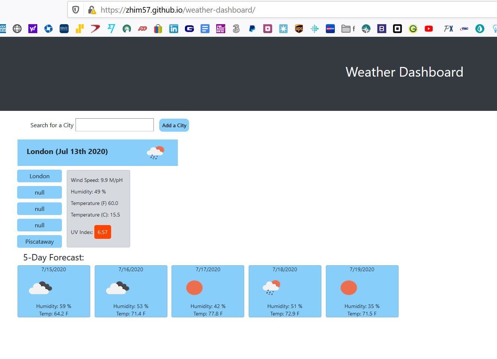

# weather-dashboard


## User Story

```
AS A traveler
I WANT to see the weather outlook for multiple cities
SO THAT I can plan a trip accordingly
```

## Acceptance Criteria


GIVEN a weather dashboard with form inputs
WHEN I search for a city
THEN I am presented with current and future conditions for that city and that city is added to the search history
WHEN I view current weather conditions for that city
THEN I am presented with the city name, the date, an icon representation of weather conditions, the temperature, the humidity, the wind speed, and the UV index
WHEN I view the UV index
THEN I am presented with a color that indicates whether the conditions are favorable, moderate, or severe
WHEN I view future weather conditions for that city
THEN I am presented with a 5-day forecast that displays the date, an icon representation of weather conditions, the temperature, and the humidity
WHEN I click on a city in the search history
THEN I am again presented with current and future conditions for that city
WHEN I open the weather dashboard
THEN I am presented with the last searched city forecast
---
created a basic interface with divs to attach the information
set appropriate classes
prepared in the js file the global variables and added the info for the AJAx call
created modules for rendering buttons, changing the color of the display for the uv index
gathering all the needed info from the response objects
variables to hold it
created elements to hold the info and appended them to the web site elements
created some formulas to convert temperature,
speed and time as needed
put a "document ready function around the whole package to guarantee the document will load fully before the javascript starts executing
[link to this portfolio](https://github.com/zhim57/weather-dashboard)
[link to the deployed application](https://zhim57.github.io/weather-dashboard)

